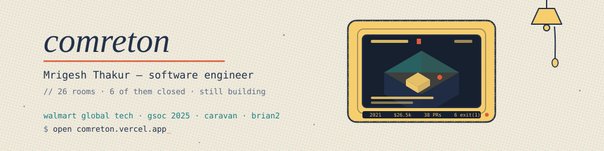

<p align="center">
  <a href="https://comreton.vercel.app">
    
  </a>
</p>

```console
$ whoami
mrigesh thakur — software engineer II, walmart global tech
               — founder · builder · open-source maintainer
               — meta xros 2023 · summer of bitcoin 2024 · google summer of code 2025

$ uptime
up since 2021 · first program printed "World I am here"
```

My whole story is a computer you can walk around in: **[comreton.vercel.app](https://comreton.vercel.app)** —
26 rooms, one per thing I have built, including the ones that failed.

---

### `ps aux` — what is running

| | | |
|---|---|---|
| **[KnowScroll](https://github.com/Legend101Zz)** | a feed that teaches instead of drains — reels composed by an LLM from cited sources | `running` |
| **[Combraton](https://github.com/Combraton)** | a control plane for AI that writes software; PIO runs and recovers it, CBR remembers it | `v0.1.0` |
| **[Brian2](https://github.com/brian-team/brian2/pull/1769)** | GSoC 2025 with INCF — moving runtime codegen from Cython to cppyy, straight to C++ | `in review` |
| **[PaperTree](https://github.com/Legend101Zz/PaperTree)** | research papers on an endless desk, with something that reads them with you | `daily` |
| **[PanelSummary](https://github.com/Legend101Zz/PanelSummary)** | any PDF turned into a comic you will actually finish | `building` |
| **[llm-from-scratch](https://github.com/Legend101Zz/llm-scratch-course)** | GPT-2 in Rust, standard library only. Third pass, no frameworks to hide behind | `learning` |

### `ps aux --exited`

| | |
|---|---|
| **Caravan** (Unchained) | bitcoin multisig — built the fee-bumping package, 31 merged PRs, #2 human contributor · now in maintenance mode |
| **Caravan-X** | one command for a private, resettable bitcoin network · on npm |
| **Fanisko** | an AR cricket wagon wheel that ran in the ICC app at the 2023 World Cup, 4M+ fans |
| **Rodhak** | live GPS tracking for Himachal government buses · [still online](https://www.dndrodhak.in) |
| **Agent-X OS · Gradient · Deauth · HonBil · TaskBust · hire-X** | six that closed. Each one paid for the next. |

---

### the tape

<p align="center">
  <picture>
    <source media="(prefers-color-scheme: dark)" srcset="https://raw.githubusercontent.com/Legend101Zz/Legend101Zz/output/snake-dark.svg">
    
  </picture>
</p>

<p align="center">
  <a href="https://comreton.vercel.app/tape" title="hover any day for the count">
    
  </a>
</p>

<p align="center"><sub><a href="https://comreton.vercel.app/tape">hover any day →</a> the same tape, live, with the count under your cursor</sub></p>

<p align="center">
  
</p>

<p align="center">
  
  
</p>

<p align="center">
  
</p>

---

### `cat resume | head`

```text
prizes     $26,500 across 5 hackathons — Euclid Aurora, Sonic DeFAI, Archway,
                   Andromeda, Findoc. Walmart Sparkathon 2023: 1st of 10,000+ teams
fellowship $11,000 across 3 — Meta XR Open Source, Summer of Bitcoin (paid in BTC),
                   Google Summer of Code
open src   38 merged PRs across Caravan, Brian2, Caravan-X
education  NIT Hamirpur, B.Tech Mathematics & Scientific Computing, GPA 9.18
stack      TypeScript · Python · Java · Rust · C++ · Spring Boot · Kafka · PyTorch
```

### `contact`

```console
$ sudo hire mrigesh
[sudo] password: ********
permission granted. anyone can run this one.
opening a channel…
→ mrigeshthakur11@gmail.com
```

[email](mailto:mrigeshthakur11@gmail.com) ·
[portfolio](https://comreton.vercel.app) ·
[boring resume](https://comreton.vercel.app/?safe=1) ·
[linkedin](https://www.linkedin.com/in/mrigesh-thakur-11new) ·
[x](https://x.com/mrigesh_thakur)

<sub>Fun fact: I read a lot of manga, which is why one of my projects turns textbooks into it.</sub>
